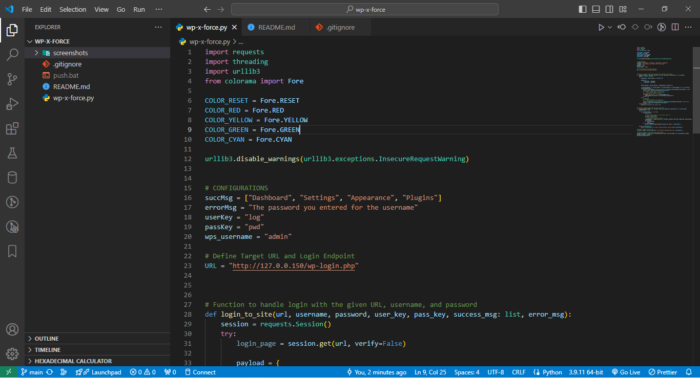
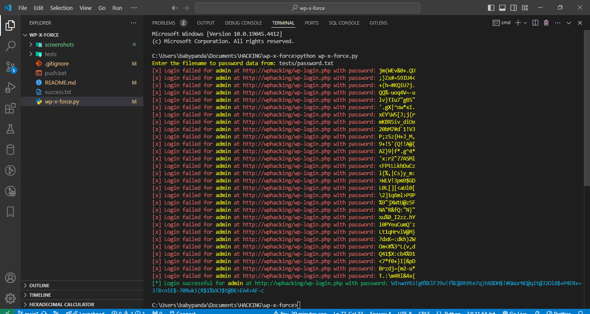
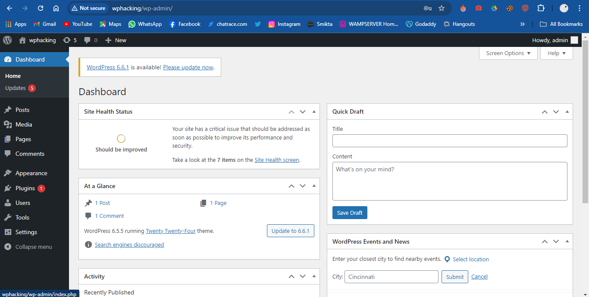
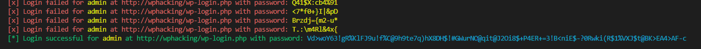

## Project: WordPress Hacking


**Objective:**
The aim of this project is to explore the security vulnerabilities in WordPress sites, particularly focusing on password cracking. This project serves as a practical exercise to understand the importance of robust password policies and the potential risks of weak credentials.

**Tools:**
1. **Target WordPress Site:** A vulnerable WordPress site set up for testing purposes. It is crucial to ensure that the site used is either owned by you or set up in a controlled environment to avoid illegal activities.
2. **Username & Password List:** As the time of writing, this script only support using a single username and a list of common passwords to carry out brute force attacks. These lists can be sourced from public datasets or generated based on common patterns.

**Languages Used:**
- **Python:** The primary language for scripting the attack. Python is chosen for its simplicity and the availability of numerous libraries that facilitate web requests and automation.

### Project Outline

#### 1. Setting Up the Environment
- **Create a Test WordPress Site:** Set up a WordPress site on a local server or a virtual machine. Ensure it is isolated from any production environment to prevent unintended consequences.
- **Prepare Username & Password Lists:** Compile a list of common usernames and passwords. Websites like `SecLists` or `RockYou` can provide extensive lists for testing.

### 2. Scripting the Attack

In this section, we will use the `requests`, `threading`, `urllib3`, and `colorama` libraries to automate and colorize our brute force attack script. 

#### Python Libraries
- **requests:** For sending HTTP requests.
- **threading:** To perform the attack using multiple threads for efficiency.
- **urllib3:** To handle HTTP requests.
- **colorama:** For adding colored output to the console for better readability.

#### Script Structure:
- **Import Libraries:**
  ```python
  import requests
  import threading
  import urllib3
  from colorama import Fore, init
  ```

- **Disable Insecure Request Warnings (Optional):**
  ```python
  urllib3.disable_warnings(urllib3.exceptions.InsecureRequestWarning)
  ```

- **Basic script configuration:**
The beauty of this script is its versatility; it's not limited to WordPress. You can use it on any site by adjusting a few configurations, as outlined below.
  ```python
  # CONFIGURATIONS
  succMsg = ["Dashboard", "Settings", "Appearance", "Plugins"] # the success message that can only been seen if the user has loggedin
  errorMsg = "The password you entered for the username" # login error message
  userKey = "log" # the HTML user input field name
  passKey = "pwd" # the HTML password input field name
  wps_username = "admin" # target username if known
  ```

- **Define Target URL and Login Endpoint:**
  ```python
  URL = "http://127.0.0.150/wp-login.php"
  ```

- **Function to handle login with the given URL, username, and password:**
  ```python
    def login_to_site(url, username, password, user_key, pass_key, success_msg: list, error_msg):
      # function body in source code file
      pass
  ```
- **Function to handle processing each line of the file:**
    ```python
    def process_lines(filename, url, username, puser_key, ppass_key, psuccess_msg: list, perror_msg):
      # function body in source code file
      pass
    ```

- **Ask user to enter password list filepath:**
  ```python
  # Get the filename from the user
  filename = input(f"{COLOR_YELLOW}Enter the filename to read password from: {COLOR_RESET}")
  ```

### 3. Executing the Attack
- **Ask user to enter password list filepath:**
  ```python
  # Create a thread for processing lines from the file
  processing_thread = threading.Thread(target=process_lines, args=(filename, URL, wps_username, userKey, passKey, succMsg, errorMsg, ))
  processing_thread.start()
  ```

### 4. Screenshots
To include screenshots and a link to the script in your Markdown file, you can use the following syntax:

### 4. Screenshots
Here are the screenshots illustrating various stages of the script execution:

1. **Initial Script Setup:**
   
   
   
2. **Brute Force Attack in Progress:**
   

3. **Successful Login Attempt:**
   

4. **Summary of Results:**
   

### Link to Script

You can find the full script on [GitHub](https://github.com/SteveSplash934/wp-x-force.git).

### 5. Analyzing the Results
- **Identify Successful Attempts:** Monitor the output to identify successful login attempts, though, script will break and save valid logins, once successful. Analyze the responses to understand which combinations worked and why.

- **Document Findings:** Create a report detailing the successful combinations, the time taken, and any patterns observed.

### Ethical Considerations
- **Legal Compliance:** Ensure that all activities are conducted in a legal and ethical manner. Only perform tests on sites you own or have explicit permission to test.
- **Responsible Disclosure:** If vulnerabilities are found on a site not owned by you, responsibly disclose them to the site owner or administrator.

### Conclusion
This project highlights the importance of strong password policies and the potential risks associated with weak credentials. By understanding these vulnerabilities, one can better secure their WordPress sites against such attacks.

### Future Work
- **Support of Username list:** Support for username list will be added in v2
- **Command-line GUI:** User-friendly command-line interaction coming soon
- **Enhanced Security Measures:** Explore additional security measures such as two-factor authentication and CAPTCHA implementation.
- **Advanced Attack Techniques:** Investigate more sophisticated attack methods and defenses against them.
- **Automated Reporting:** Develop scripts to automatically generate reports based on the findings, providing a comprehensive overview of the security posture of the target site.